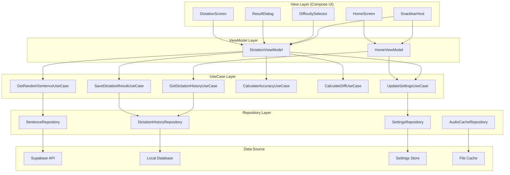
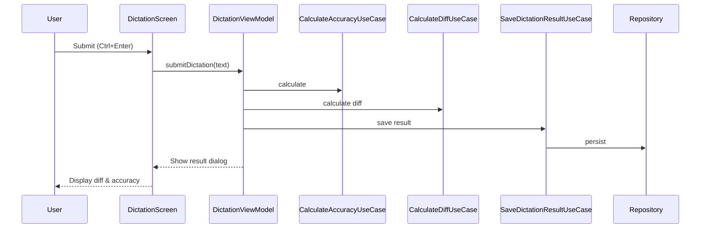

# Technical Design

## 概要

Inglyph アプリの MVP 機能強化の技術設計。既存の MVVM + Repository + UseCase アーキテクチャを拡張し、学習履歴の永続化、詳細な結果表示、改善された UX、キーボード操作対応を実装する。

## アーキテクチャ



## 技術スタック

- **フロントエンド**: Kotlin Multiplatform + Compose Multiplatform
- **状態管理**: StateFlow + ViewModel
- **ローカル DB**: SQLDelight (マルチプラットフォーム対応)
- **設定管理**: multiplatform-settings (統一的な KMM 対応設定管理)
- **ネットワーク**: Ktor Client
- **DI**: Koin
- **非同期処理**: Kotlin Coroutines
- **テスト**: Kotlin Test + MockK

## コンポーネントとインターフェース

### View 層の新規/更新コンポーネント

#### DifficultySelector

```kotlin
@Composable
fun DifficultySelector(
    selectedDifficulty: DifficultyLevel,
    onDifficultyChange: (DifficultyLevel) -> Unit,
    modifier: Modifier = Modifier
) {
    // セグメントコントロール風のUI
    // キーボードショートカット対応（1-6キー）
}
```

#### DiffTextComparator

```kotlin
@Composable
fun DiffTextComparator(
    correctText: String,
    userInput: String,
    modifier: Modifier = Modifier
) {
    // Git diff形式での表示
    // 削除: 赤色背景、追加: 緑色背景
}
```

#### ResultDialog

```kotlin
@Composable
fun ResultDialog(
    result: DictationResult,
    onDismiss: () -> Unit,
    onRetry: () -> Unit
) {
    // DiffTextComparatorを使用
    // 正解率、所要時間、日本語訳表示
}
```

#### SnackbarController

```kotlin
object SnackbarController {
    fun showError(
        message: String,
        actionLabel: String? = null,
        onAction: (() -> Unit)? = null
    )

    fun showSuccess(message: String)

    fun showInfo(
        message: String,
        duration: SnackbarDuration = SHORT
    )
}
```

### ViewModel 層の更新

#### DictationViewModel

```kotlin
class DictationViewModel(
    private val getRandomSentenceUseCase: GetRandomSentenceUseCase,
    private val saveDictationResultUseCase: SaveDictationResultUseCase,
    private val calculateAccuracyUseCase: CalculateAccuracyUseCase,
    private val calculateDiffUseCase: CalculateDiffUseCase,
    private val updateSettingsUseCase: UpdateSettingsUseCase,
    private val audioCacheRepository: AudioCacheRepository
) : ViewModel() {

    private val _uiState = MutableStateFlow(DictationUiState())
    val uiState: StateFlow<DictationUiState> = _uiState.asStateFlow()

    fun changeDifficulty(difficulty: DifficultyLevel)
    fun submitDictation(userInput: String)
    fun playAudio()
    fun fetchNewSentence()
    fun handleKeyboardShortcut(key: KeyEvent)
}
```

### UseCase 層の新規コンポーネント

#### CalculateDiffUseCase

```kotlin
class CalculateDiffUseCase {
    data class DiffResult(
        val segments: List<DiffSegment>
    )

    sealed class DiffSegment {
        data class Unchanged(val text: String) : DiffSegment()
        data class Added(val text: String) : DiffSegment()
        data class Deleted(val text: String) : DiffSegment()
    }

    operator fun invoke(
        correctText: String,
        userInput: String
    ): DiffResult
}
```

## データフロー

### ディクテーション提出フロー



## データモデル

### ローカル DB スキーマ (SQLDelight)

```sql
CREATE TABLE dictation_history (
    id TEXT PRIMARY KEY,
    sentence_id TEXT NOT NULL,
    sentence_text TEXT NOT NULL,
    user_input TEXT NOT NULL,
    difficulty TEXT NOT NULL,
    accuracy REAL NOT NULL,
    duration INTEGER NOT NULL,
    timestamp INTEGER NOT NULL,
    japanese_translation TEXT
);

CREATE INDEX idx_history_timestamp ON dictation_history(timestamp DESC);

CREATE TABLE cached_audio (
    sentence_id TEXT PRIMARY KEY,
    file_path TEXT NOT NULL,
    cached_at INTEGER NOT NULL
);

-- 古いキャッシュを削除するためのインデックス
CREATE INDEX idx_audio_cache_time ON cached_audio(cached_at);
```

### データモデル

```kotlin
@Serializable
data class DictationResult(
    val sentenceId: String,
    val userInput: String,
    val correctText: String,
    val accuracy: Float,
    val duration: Long,
    val timestamp: Instant,
    val diffSegments: List<DiffSegment>
)

@Serializable
data class AppSettings(
    val audioSpeed: Float = 1.0f,
    val autoPlay: Boolean = false,
    val showHints: Boolean = true,
    val selectedDifficulty: String = "A1",
    val showKeyboardShortcuts: Boolean = true
)
```

## エラーハンドリング

### エラー種別と対応

```kotlin
sealed class AppError {
    data class NetworkError(val message: String) : AppError()
    data class ApiError(val code: Int, val message: String) : AppError()
    data class AudioLoadError(val sentenceId: String) : AppError()
    data class StorageError(val operation: String) : AppError()
    object OfflineError : AppError()
}

// ViewModelでの処理
when (error) {
    is NetworkError -> SnackbarController.showError(
        "インターネット接続を確認してください",
        actionLabel = "再試行",
        onAction = ::retry
    )
    is ApiError -> SnackbarController.showError(
        "サーバーエラーが発生しました"
    )
    is AudioLoadError -> SnackbarController.showError(
        "音声ファイルの読み込みに失敗しました",
        actionLabel = "再読み込み",
        onAction = ::reloadAudio
    )
    is OfflineError -> SnackbarController.showInfo(
        "オフラインモードです"
    )
}
```

## セキュリティ考慮事項

- ローカルストレージの暗号化は不要（学習履歴は機密情報ではない）
- API キーはローカルに保存しない（Supabase の匿名キーのみ使用）
- ユーザー入力のサニタイゼーション（XSS 対策）
- SQL インジェクション対策（SQLDelight のパラメータバインディング使用）

## パフォーマンスとスケーラビリティ

### キャッシュ戦略

- 音声ファイル: 最大 50 ファイルまでキャッシュ、LRU 方式で削除
- 学習履歴: 最新 1000 件まで保持、それ以降は古いものから削除
- 設定: インメモリキャッシュ + 永続化

### 最適化

- 音声ファイルのプリロード（次の問題の音声を事前に取得）
- 履歴表示の遅延読み込み（最初は 10 件、スクロールで追加読み込み）
- Diff 計算の最適化（Myers' diff algorithm 使用）

## テスト戦略

### 単体テスト

- UseCase: 全てのビジネスロジックをテスト
- ViewModel: StateFlow の状態遷移をテスト
- Repository: モック化したデータソースでテスト

### 統合テスト

- ディクテーション提出フロー全体
- オフライン時の動作
- キーボードショートカットの動作

### UI テスト

- Compose Testing API を使用
- スナップショットテスト（差分表示の見た目）
- アクセシビリティテスト

## プラットフォーム固有の実装

### 設定管理の統一実装 (multiplatform-settings)

```kotlin
// commonMain
class LocalSettingsRepository(
    private val settings: Settings
) : SettingsRepository {

    override suspend fun getSettings(): AppSettings {
        return AppSettings(
            audioSpeed = settings.getFloat("audio_speed", 1.0f),
            autoPlay = settings.getBoolean("auto_play", false),
            showHints = settings.getBoolean("show_hints", true),
            selectedDifficulty = settings.getString("selected_difficulty", "A1"),
            showKeyboardShortcuts = settings.getBoolean("show_keyboard_shortcuts", true)
        )
    }

    override suspend fun updateSettings(settings: AppSettings) {
        this.settings.putFloat("audio_speed", settings.audioSpeed)
        this.settings.putBoolean("auto_play", settings.autoPlay)
        this.settings.putBoolean("show_hints", settings.showHints)
        this.settings.putString("selected_difficulty", settings.selectedDifficulty)
        this.settings.putBoolean("show_keyboard_shortcuts", settings.showKeyboardShortcuts)
    }
}

// 各プラットフォームでの Settings 初期化
// Android: SharedPreferences
// iOS: NSUserDefaults
// Desktop: Properties/PreferencesFactory
```

### オーディオ再生のプラットフォーム固有実装

```kotlin
// commonMain/platform/AudioPlayer.kt
expect class AudioPlayer {
    fun loadAudio(url: String)
    fun play()
    fun pause()
    fun stop()
    fun setSpeed(speed: Float)
    fun isPlaying(): Boolean
    fun release()
}

// androidMain
actual class AudioPlayer {
    private var mediaPlayer: MediaPlayer? = null

    actual fun loadAudio(url: String) {
        mediaPlayer = MediaPlayer().apply {
            setDataSource(url)
            prepareAsync()
        }
    }

    actual fun play() {
        mediaPlayer?.start()
    }

    actual fun setSpeed(speed: Float) {
        if (Build.VERSION.SDK_INT >= Build.VERSION_CODES.M) {
            mediaPlayer?.playbackParams = mediaPlayer?.playbackParams?.setSpeed(speed)
        }
    }
    // ... 他のメソッド実装
}

// desktopMain (JavaFX MediaPlayer使用)
actual class AudioPlayer {
    private var mediaPlayer: javafx.scene.media.MediaPlayer? = null

    actual fun loadAudio(url: String) {
        val media = javafx.scene.media.Media(url)
        mediaPlayer = javafx.scene.media.MediaPlayer(media)
    }

    actual fun setSpeed(speed: Float) {
        mediaPlayer?.rate = speed.toDouble()
    }
    // ... 他のメソッド実装
}

// iosMain (AVAudioPlayer使用)
actual class AudioPlayer {
    private var audioPlayer: AVAudioPlayer? = null

    actual fun loadAudio(url: String) {
        val nsUrl = NSURL(string = url)
        audioPlayer = AVAudioPlayer(contentsOfURL = nsUrl, error = null)
        audioPlayer?.prepareToPlay()
    }

    actual fun setSpeed(speed: Float) {
        audioPlayer?.rate = speed
    }
    // ... 他のメソッド実装
}
```

### デスクトップ版キーボードハンドリング

```kotlin
// desktopMain
actual class KeyboardHandler {
    actual fun setupKeyboardShortcuts(
        onDifficultyChange: (Int) -> Unit,
        onSubmit: () -> Unit,
        onPlayPause: () -> Unit,
        onNewSentence: () -> Unit,
        onReplay: () -> Unit
    ) {
        // AWTのKeyListenerを使用
    }
}
```

### モバイル版の考慮事項

- タッチ操作に最適化された UI
- スワイプジェスチャーでの難易度変更
- 音声再生時の音量ボタン制御
